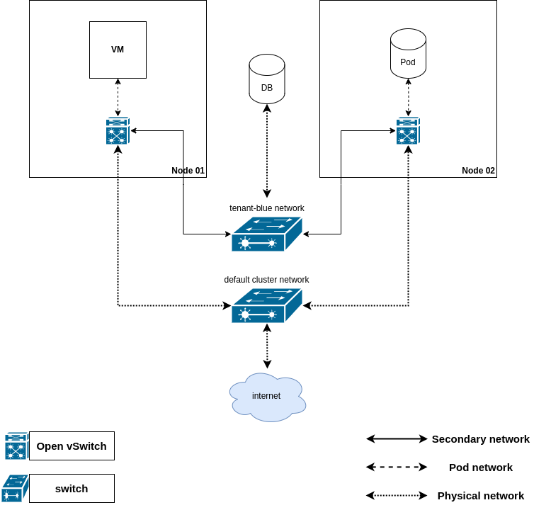
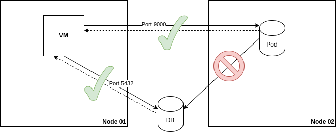

# MultiNetworkPolicies
## Introduction
[multi-networkpolicy](https://github.com/k8snetworkplumbingwg/multi-networkpolicy) provides
[network policy](https://kubernetes.io/docs/concepts/services-networking/network-policies/)
features for secondary networks, and allow enhanced traffic security.

## Motivation
In Kubernetes the paradigm is that by default all pods can reach other pods, and security is provided by
implementing [Network Policy](https://kubernetes.io/docs/concepts/services-networking/network-policies/).
MultiNetworkPolicies provide the same security solution to secondary interfaces.
For users seeking network security using multi-homing - traffic restrictions based on user network configuration is a
recommended practice.

For example, by defining policies that specify which services a workload can access, they mitigate supply chain attacks.
Even if a component is compromised, it won’t be able to jeopardize other components of the system.

## User-Stories
As a project administrator, I want to enforce network policies that must be adhered to by all workloads on
my namespace. This will secure my namespace’s network traffic.

## User-case
- Limit access to a database set outside the cluster, connected to VM and Pod workloads via localnet overlay network:
  In this case example, only the VM has access to the database.
  
  

## How to enable this feature on an OVN-Kubernetes cluster?
In order to enable multi-networkPolicies on OVN-Kubernetes, the `enable-multi-network` flag
under `OVNKubernetesFeatureConfig` on the OVN-Kubernetes config must be enabled.

## Workflow Description
To configure pod isolation, the user must:
- provision a `network-attachment-definition`.
- provision a `MultiNetworkPolicy` indicating to which secondary networks it
  applies via the
  [policy-for](https://github.com/k8snetworkplumbingwg/multi-networkpolicy#policy-for-annotation)
  annotation.

Please refer to the following example:

```yaml
---
apiVersion: k8s.cni.cncf.io/v1
kind: NetworkAttachmentDefinition
metadata:
  name: tenant-blue
spec:
    config: '{
        "cniVersion": "0.4.0",
        "name": "tenant-blue-net",
        "netAttachDefName": "default/tenant-blue",
        "topology": "layer2",
        "type": "ovn-k8s-cni-overlay",
        "subnets": "192.168.100.0/24"
    }'
---
apiVersion: k8s.cni.cncf.io/v1beta1
kind: MultiNetworkPolicy
metadata:
  annotations:
    k8s.v1.cni.cncf.io/policy-for: default/tenant-blue # indicates the net-attach-defs this policy applies to
  name: allow-ports-same-ns
spec:
  podSelector:
    matchLabels:
      app: stuff-doer # the policy will **apply** to all pods with this label
  ingress:
  - ports:
    - port: 9000
      protocol: TCP
    from:
    - namespaceSelector:
        matchLabels:
          role: trusted # only pods on namespaces with this label will be allowed on port 9000
  policyTypes:
    - Ingress
```

Please note the `MultiNetworkPolicy` has the **exact same** API of the native
`networking.k8s.io/v1` `NetworkPolicy`object; check its documentation for more
information.

**Note:** `net-attach-def`s referred to by the `k8s.v1.cni.cncf.io/policy-for`
annotation without the subnet attribute defined are possible if the policy
**only features** `ipBlock` peers. If the `net-attach-def` features the
`subnet` attribute, it can also feature `namespaceSelectors` and `podSelectors`.

## User facing API Changes
There are no user facing API Changes.
